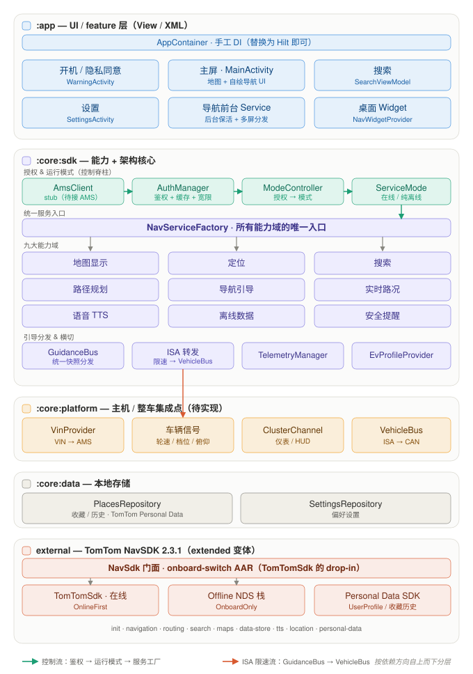

# 架构总览

面向**首次打开本工程**的同学：一页看懂工程结构与整体架构。

本工程是基于 **TomTom NavSDK 2.3.1** 的车机导航 Demo 起步工程，UI 采用 **Jetpack Compose**
（地图仍是命令式 `MapView`，经 `AndroidView` 内嵌、生命周期由宿主 Activity 转发——SDK 调用方式不变），
按依赖方向自上而下分为四个 Gradle 模块 + 外部 SDK。核心思想：**UI 不直接持有 SDK 句柄，
一律经 `NavServiceFactory` 获取能力服务；授权状态变化时由 `ServiceModeController` 切换运行模式，
调用方重建服务，业务代码零感知。**

## 分层架构图

> 绿色箭头＝控制流（鉴权 → 运行模式 → 服务工厂）；珊瑚色箭头＝ISA 限速流。
> 依赖方向：`:app → :core:sdk → {:core:platform, :core:data, external}`；
> `:core:sdk` 以 `api(...)` 把 SDK 与 `:core:platform` 暴露给上层，`:core:data` 直接依赖 Personal Data 模块。

## 模块结构

| 模块 | 角色 | 关键内容 |
|---|---|---|
| `:app` | UI / feature 层（Jetpack Compose） | [`App`](../app/src/main/kotlin/com/tomtom/demo/nav/App.kt) 内 `AppContainer` 手工 DI；按 feature 分包：home / search / settings / onboarding / guidance / widget；`MainActivity` 持有 `MapView` 与编排逻辑，Compose 仅渲染状态并回调 |
| `:core:sdk` | 能力 + 架构核心 | 鉴权、运行模式、`NavServiceFactory`、九大能力域、`GuidanceBus` |
| `:core:platform` | 主机 / 整车集成点（待实现） | VIN、CAN、车辆信号、仪表通道——均为 `interface` + `Stub*` 占位实现 |
| `:core:data` | 本地存储 | 收藏 / 历史（TomTom Personal Data 模块）、偏好设置 |
| external | TomTom NavSDK 2.3.1（**extended** 变体） | 经 `NavSdk` 门面（onboard-switch AAR）接入；个性化数据用 Personal Data SDK |

> **构建变体**：工程使用 **extended** 变体（`missingDimensionStrategy("tomtom-sdk-version", "extended")`），
> 因为纯离线（NavSdk OnboardOnly）与 Personal Data API 均为 `@RestrictToExtendedFlavor`。
> extended 制品需鉴权访问 TomTom Artifactory（complete 变体则公开可取）。

## 核心数据流

### ① 授权驱动运行模式（控制平面）

开机即异步鉴权（VIN 来自平台层），授权状态唯一决定运行模式；UI 订阅模式做"模式驱动重建"：
有效 / 宽限期内 → `ONLINE_FIRST`（创建在线服务）；无效 / 超时且无缓存 → `ONBOARD_ONLY`
（当前 Demo 抛 `OnboardDataNotProvisioned`，待 NDS 数据灌装）。

入口：[`AuthManager`](../core/sdk/src/main/kotlin/com/tomtom/demo/nav/core/sdk/auth/AuthManager.kt) ·
[`ServiceModeController`](../core/sdk/src/main/kotlin/com/tomtom/demo/nav/core/sdk/ServiceModeController.kt) ·
[`NavServiceFactory`](../core/sdk/src/main/kotlin/com/tomtom/demo/nav/core/sdk/NavServiceFactory.kt)。

### ② NavSdk 门面（取代 TomTomSdk）

`NavServiceFactory.createNavigationEngine` 调 `NavSdk.initialize(ctx, NavMode.OnlineFirst(...))`；
门面在线模式转发原生 `TomTomSdk`，离线模式构建 NDS 栈（当前 Demo 仅走在线分支）。
门面以本地 AAR 形式分发，见 [`local-repo/`](../local-repo/README.md)。

入口：[`NavServiceFactory`](../core/sdk/src/main/kotlin/com/tomtom/demo/nav/core/sdk/NavServiceFactory.kt)。

### ③ 多屏引导分发（数据平面）

导航引擎只被 `GuidanceBus` 订阅一次，广播统一 `GuidanceSnapshot` 给所有消费端
（自绘导航面板、语音播报、前台 Service 通知、桌面 Widget、仪表 `ClusterChannel`、
`IsaSpeedLimitForwarder → VehicleBus → CAN → 整车 ISA`）。消费端只依赖快照，不触达 SDK 类型。

入口：[`GuidanceBus`](../core/sdk/src/main/kotlin/com/tomtom/demo/nav/core/sdk/guidance/GuidanceBus.kt) ·
[`IsaSpeedLimitForwarder`](../core/sdk/src/main/kotlin/com/tomtom/demo/nav/core/sdk/guidance/IsaSpeedLimitForwarder.kt)。

### ④ 个性化数据（收藏 / 历史）

`SearchViewModel → PlacesRepository → TomTom Personal Data SDK`（离线本地存储，
`PersonalDataFactory.create(...) → UserProfile/UserLocations`），映射回 `SavedPlace` 模型供 UI 使用。
跨设备云同步可后续接 `OnlinePersonalDataConfiguration`。

入口：[`PlacesRepository`](../core/data/src/main/kotlin/com/tomtom/demo/nav/core/data/Places.kt)。

## 关键设计规则

- **单一服务入口**：UI / ViewModel 只经 `NavServiceFactory` 取能力服务，不直接 new SDK 对象。
- **单一模式开关**：`ServiceMode` 是全应用唯一的在线/离线开关，由授权状态推导。
- **平台适配层隔离**：所有主机 / 整车耦合点收敛在 `:core:platform` 的接口里（WS5 替换为真实实现）。
- **引导数据契约**：多屏消费端只依赖 `GuidanceSnapshot`，通道实现可独立演进。
- **后台保活**：导航期间由 `NavigationForegroundService`（`foregroundServiceType=location`）保活进程并持续后台定位 / ISA 转发 —— 取代了 SDK `NavigationFragment(keepInBackground=true)` 内部的 `TomTomNavigationService`（自绘 UI 后该机制不再可用）。
